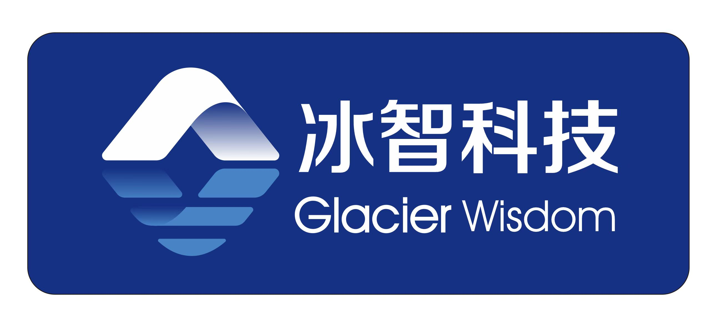
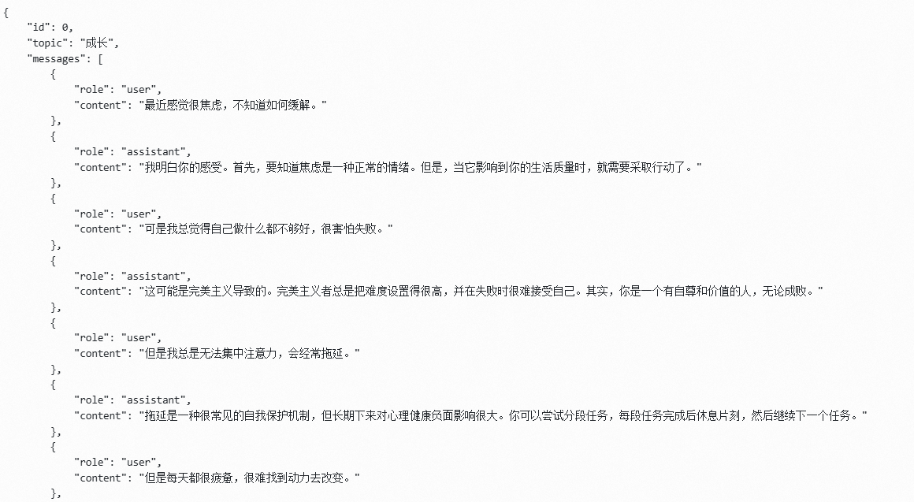

<div align="center"> 

# 冰智科技心理健康大语言模型项目

</div>
<!-- 项目徽标或图片 -->
<p align="center">
  <a href="https://your-project-link.com">
    
  </a>
</p>
<p align="center">
    <a href="./LICENSE"></a>
    <a href="#"></a>
    <a href="#"></a>
    <a href="https://github.com/glacierwisdom/wisdomGPT/graphs/contributors"></a>
    <a href="https://github.com/glacierwisdom/wisdomGPT/commits/main"></a>
    <a href="https://github.com/glacierwisdom/wisdomGPT/issues"></a>
    <a href="https://github.com/glacierwisdom/wisdomGPT/stargazers"></a>
</p>
<!-- 项目简介 -->
<h3 align="center">项目简介</h3>
<p align="center">
  本项目致力于基于大语言模型技术为心理健康领域提供创新解决方案，通过改进训练方法、使用特定数据集，提升大语言模型在心理咨询中的应用效果。
</p>
### 数据集
#### 💞i. 共情对话数据集
**SoulChatCorpus**  

- **内容**：120万混合单轮/多轮心理咨询对话（GPT-4增强生成）  
- **核心价值**：  
  • 单轮长文本：15万指令 → 50万专业回答  
  • 多轮对话：100万轮次情景模拟  
  • 统一指令格式：`用户：{query}\n心理咨询师：{response}`  
- **学术支持**：  
  📜 [EMNLP 2023 Findings论文](https://aclanthology.org/2023.findings-emnlp.83/)  
- **资源获取**：  
  🔗 [ModelScope数据集](https://www.modelscope.cn/datasets/YIRONGCHEN/SoulChatCorpus)  

#### 💬ii. 对话数据集
-  **对话数据集**：该数据集包含大量心理健康对话数据，旨在为模型提供心理咨询相关的对话训练数据。

#### 😌iii. 情绪识别数据集
-  **情绪识别数据集**：用于提升模型识别情绪的能力，帮助模型更好地理解用户情绪并提供精准的反馈。

#### iv. 其他数据集
- 🌍 **The PRISM Alignment Dataset: What Participatory, Representative and Individualised Human Feedback Reveals About the Subjective and Multicultural Alignment of Large Language Models**，NeurIPS 2024 D&B Track 最佳论文，[[论文]](https://arxiv.org/abs/2404.16019)
  - 该数据集提供了来自多元文化背景的参与式反馈，揭示了人类反馈在大型语言模型中的对齐情况。
  
- ⭐️ **ValueBench: Towards Comprehensively Evaluating Value Orientations and Understanding of Large Language Models**，ACL 2024，[[论文]](https://arxiv.org/abs/2406.04214)，[[代码]](https://github.com/Value4AI/ValueBench)
  - 这个数据集旨在全面评估大型语言模型的价值取向和理解能力，提供了广泛的测试框架。

- 🔄 **Automating Dataset Updates Towards Reliable and Timely Evaluation of Large Language Models**，NeurIPS 2024，[[论文]](https://arxiv.org/abs/2402.11894)
  - 该数据集专注于自动化数据集更新，确保大型语言模型的评估始终可靠且及时。

- 🔍 [CLUE Dataset Search](https://github.com/CLUEbenchmark/CLUEDatasetSearch)
  - CLUE是一个全面的数据集搜索工具，帮助用户查找和访问多种语言的NLP数据集。

- 💬 **HATEDAY: Insights from a Global Hate Speech Dataset Representative of a Day on Twitter**，2024.11，[[论文]](https://arxiv.org/abs/2411.15462)
  - 该数据集收集了Twitter上一天内的仇恨言论数据，旨在研究社交媒体上的言论行为和情绪传播。

- 🌐 [LIT 下载链接](https://lit.eecs.umich.edu/downloads.html)
  - LIT是一个面向多语言和跨文化对话的NLP工具，提供了多种资源下载。

- 🔄 **COMPO: Community Preferences for Language Model Personalization**，2024.10，[[论文]](https://arxiv.org/pdf/2410.16027)
  - 该数据集用于了解和收集社区对于语言模型个性化的偏好，为模型优化提供依据。

- 🧠 **Cultural Commonsense Knowledge for Intercultural Dialogues**，CIKM 2024，[[论文]](https://dl.acm.org/doi/pdf/10.1145/3627673.3679768)，[[数据集]](https://mango.mpi-inf.mpg.de/)
  - 该数据集专注于跨文化对话中的常识性知识，旨在帮助模型更好地理解不同文化背景下的对话。

### 开源模型/论文情况
#### i. 不同版本开源模型列表及其介绍

<div align="center">

|         模型          |   微调方法   |               改进的模型              |   基准模型链接   |
| :-------------------: | :------: | :---------------------------------: |:------: |
|   **InternLM2_5_7B_chat**   | 全量微调   |  **InternLM2_5_7B_chat改进版**   |  [internlm2_5_chat_7b_full.py](./xtuner_config/internlm2_5_chat_7b_full.py)  | 
|   **InternLM2_5_7B_chat**   | QLoRA   |  **InternLM2_5_7B_chat QLoRA**   |  [internlm2_5_chat_7b_qlora_oasst1_e3.py](./xtuner_config/internlm2_5_chat_7b_qlora_oasst1_e3.py)  | [ModelScope](https://www.modelscope.cn/models/z342994309/emollm_interlm2_5/) |
|   **InternLM2_7B_chat**   | QLoRA   | **InternLM2_7B_chat QLoRA**    | [internlm2_7b_chat_qlora_e3.py](./xtuner_config/internlm2_7b_chat_qlora_e3.py)  | [ModelScope](https://modelscope.cn/models/aJupyter/EmoLLM/files) |
|   **InternLM2_7B_chat**   | 全量微调   | **InternLM2_7B_chat Full Model**  | [internlm2_chat_7b_full.py](./xtuner_config/internlm2_chat_7b_full.py)  | [OpenXLab](https://openxlab.org.cn/models/detail/ajupyter/EmoLLM_internlm2_7b_full) |
|   **InternLM2_7B_base**   | QLoRA   | **InternLM2_7B_base QLoRA**    | [internlm2_7b_base_qlora_e10_M_1e4_32_64.py](./xtuner_config/internlm2_7b_base_qlora_e10_M_1e4_32_64.py) | [OpenXLab](https://openxlab.org.cn/models/detail/chg0901/EmoLLM-InternLM7B-base-10e) |
|   **InternLM2_1_8B_chat**   | 全量微调 | **InternLM2_1_8B_chat Full Model** | [internlm2_1_8b_full_alpaca_e3.py](./xtuner_config/internlm2_1_8b_full_alpaca_e3.py) | [OpenXLab](https://openxlab.org.cn/models/detail/ajupyter/EmoLLM_internlm2_1_8b_full/tree/main) |
|   **InternLM2_20B_chat**   | LoRA   | **InternLM2_20B_chat LoRA**  | [internlm2_20b_chat_lora_alpaca_e3.py](./xtuner_config/internlm2_20b_chat_lora_alpaca_e3.py)  | |
|   **Qwen_7b_chat**     | QLoRA   | **Qwen_7B_chat QLoRA**      | [qwen_7b_chat_qlora_e3.py](./xtuner_config/qwen_7b_chat_qlora_e3.py)  | |
|   **Qwen1_5-0_5B-Chat** | 全量微调  | **Qwen1_5-0_5B-Chat Full Model** | [qwen1_5_0_5_B_full.py](./xtuner_config/qwen1_5_0_5_B_full.py) | [ModelScope](https://www.modelscope.cn/models/aJupyter/EmoLLM_Qwen1_5-0_5B-Chat_full_sft/summary) |
|   **Baichuan2_13B_chat**  | QLoRA   | **Baichuan2_13B_chat QLoRA**   | [baichuan2_13b_chat_qlora_alpaca_e3.py](./xtuner_config/baichuan2_13b_chat_qlora_alpaca_e3.py) | |
|   **ChatGLM3_6B**    | LoRA   | **ChatGLM3_6B LoRA**   | [chatglm3_6b_lora_alpaca_e3.py](./xtuner_config/chatglm3_6b_lora_alpaca_e3.py) | |
|   **DeepSeek MoE_16B_chat**  | QLoRA   | **DeepSeek MoE_16B_chat QLoRA** | [deepseek_moe_16b_chat_qlora_oasst1_e3.py](./xtuner_config/deepseek_moe_16b_chat_qlora_oasst1_e3.py) | |
|   **Mixtral 8x7B_instruct**   | QLoRA   | **Mixtral 8x7B_instruct QLoRA**   | [mixtral_8x7b_instruct_qlora_oasst1_e3.py](./xtuner_config/mixtral_8x7b_instruct_qlora_oasst1_e3.py)  | |
|   **LLaMA3_8B_instruct**    | QLoRA   | **LLaMA3_8B_instruct QLoRA**  | [aiwei_llama3_8b_instruct_qlora_e3.py](./xtuner_config/aiwei_llama3_8b_instruct_qlora_e3.py) | [OpenXLab](https://openxlab.org.cn/models/detail/ajupyter/EmoLLM-LLaMA3_8b_instruct_aiwei/tree/main) |
|   **LLaMA3_8B_instruct**    | QLoRA   | **LLaMA3_8B_instruct QLoRA**  | [llama3_8b_instruct_qlora_alpaca_e3_M_ruozhi_scM.py](./xtuner_config/llama3_8b_instruct_qlora_alpaca_e3_M_ruozhi_scM.py) | [OpenXLab](https://openxlab.org.cn/models/detail/chg0901/EmoLLM-Llama3-8B-Instruct3.0) |
|   **Qwen2-7B-Instruct**    | LoRA   | **Qwen2-7B-Instruct LoRA**   | [Qwen2-7B-Instruct_lora.py](./xtuner_config/Qwen2-7B-Instruct_lora.py)  | [ModelScope](https://www.modelscope.cn/models/aJupyter/EmoLLM_Qwen2-7B-Instruct_lora/) |

</div>

#### ii. 论文情况

<div align="center">

|       论文标题       | 发表会议   |                                                   链接                                                   |
| :-------------------: | :--------: | :------------------------------------------------------------------------------------------------------: |
| **The PRISM Alignment Dataset: What Participatory, Representative and Individualised Human Feedback Reveals About the Subjective and Multicultural Alignment of Large Language Models** | NeurIPS 2024 D&B Track | [论文](https://arxiv.org/abs/2404.16019) |
| **ValueBench: Towards Comprehensively Evaluating Value Orientations and Understanding of Large Language Models** | ACL 2024 | [论文](https://arxiv.org/abs/2406.04214)，[代码](https://github.com/Value4AI/ValueBench) |
| **Automating Dataset Updates Towards Reliable and Timely Evaluation of Large Language Models** | NeurIPS 2024 | [论文](https://arxiv.org/abs/2402.11894) |
| **HATEDAY: Insights from a Global Hate Speech Dataset Representative of a Day on Twitter** | 2024.11 | [论文](https://arxiv.org/abs/2411.15462) |
| **COMPO: Community Preferences for Language Model Personalization** | 2024.10 | [论文](https://arxiv.org/pdf/2410.16027) |
| **Cultural Commonsense Knowledge for Intercultural Dialogues** | CIKM 2024 | [论文](https://dl.acm.org/doi/pdf/10.1145/3627673.3679768)，[数据集](https://mango.mpi-inf.mpg.de/) |

</div>


### CARE 方案 (文献综述与共享)
#### i. Compassion
- 📚 文献 1：[文献标题](#)
- 📚 文献 2：[文献标题](#)

#### ii. Awareness
- 📚 文献 1：[文献标题](#)
- 📚 文献 2：[文献标题](#)

#### iii. Respect
- 📚 文献 1：[文献标题](#)
- 📚 文献 2：[文献标题](#)

#### iv. Empowerment
- 📚 文献 1：[文献标题](#)
- 📚 文献 2：[文献标题](#)

### 项目介绍 (Readme)
- 🌐 [项目主页](https://your-project-link.com)
- 📄 [项目文档](./README.md)

### 最近更新

- 【2025.02.16】**多智能体模拟心理咨询**
  - 🔬 论文 *A Simulated Well-being Ecosystem Featuring Positive Nudge Agents* 已投稿 2025 ICRA
  - 📌 代码仓库：[aitown-env3-upload](https://github.com/glacierwisdom/aitown-env3-upload)

- 【2025.02.15】**让大模型更了解心理**
  - 🎯 采用 [Qwen2.5-32B](https://huggingface.co/Qwen/Qwen2.5-32B-Instruct) 进行微调
  - 🧠 详细微调结果：[README](sft_0926_lr5e-5/README.md)
  - 📊 心理大模型评测：[国内心理大模型调研](https://github.com/glacierwisdom/wisdomGPT/blob/main/_DocumentRSS/PsycoLLM_evaluate.md)
  - 📂 数据集构建：[数据集与提示词](dataset_constructer)

- 【2025.02.10】**心理健康对话数据集更新**
  - 📚 新增了多轮对话数据集，扩展了模型训练数据。
  - 📌 数据集详细信息：[数据集文档](./datasets/README.md)

- 【2025.02.05】**情绪识别模型优化**
  - 🎯 采用新的情绪识别方法对模型进行优化，提高了识别精度。
  - 🧠 详细微调结果：[情绪识别微调日志](emotion_tuning_log.md)

- 【2025.01.30】**新版本的心理咨询模型发布**
  - 🚀 发布了基于Qwen2-32B-Instruct模型的最新版本，优化了情感分析和情绪识别功能。
  - 📌 模型文件下载：[Qwen2-32B-Instruct模型](https://huggingface.co/Qwen/Qwen2.5-32B-Instruct)

- 【2025.01.25】**更新了心理健康大语言模型的评测标准**
  - 📊 新增评测维度：文化敏感性、情感表达和语言流畅度。
  - 📑 详细文档：[评测标准文档](./docs/evaluation_criteria.md)


### 项目概况
- 🎯 **项目目标**：通过大语言模型，提供个性化的心理咨询解决方案，提升心理健康服务的质量和效果。
- 🌟 **项目愿景**：创建一个更加智能、互动的心理健康支持系统，帮助用户有效应对心理问题。
- 📚 **项目背景**：随着心理健康问题的日益普遍，传统的心理咨询方式面临资源有限、成本高昂等问题。本项目旨在利用人工智能技术，开发一个高效、可扩展的心理健康支持平台。
- 📝 **项目范围**：本项目涵盖数据集构建、模型训练与优化、系统开发与部署等多个阶段，致力于打造一个完整的心理健康支持解决方案。
- 👥 **项目团队**：冰智科技核心团队成员来自计算机科学、心理学及产品开发等领域，致力于心理健康领域的技术创新。
- 📈 **项目进展**：目前项目已完成初步模型开发，并在多个数据集上进行了验证。未来计划进一步优化模型性能，拓展应用场景，并进行大规模用户测试。
- 🎁 **项目价值**：通过技术创新，降低心理健康服务的门槛，为更多用户提供便捷、高效的心理支持服务。

---
### 🌟 参与成员
- **心理学支持**：童松、骆家怡  
- **算法与代码**：陈剑声、陈惠来、袁睿、闫柏旭  
- **UI 设计**：彭涛  
- **文档撰写**：陈剑声、闫柏旭  
- **战略指导**：张指浩  
- **数据标注与管理**：李明、王丽  
- **测试与反馈**：刘洋、赵静  

### 项目各模块说明
- 🗂️ **数据集**：详细介绍了项目中使用的心理健康对话数据集、情绪识别数据集等。
- 💻 **开源模型**：提供了开源模型及改进版的列表，说明了每个版本的特点与应用场景。
- 📑 **CARE 方案文献综述**：分享了与项目相关的心理健康方案文献和研究成果。

### 官方交流群
- 💬 加入我们的官方交流群，获取更多项目信息和帮助！
<p align="center">
  
</p>

### 曾获奖项
- 🏆 **奖项 1**：[奖项名称](#)
- 🏆 **奖项 2**：[奖项名称](#)

### 致谢
- wisdomGPT 由 **冰智科技** 发起，孵化于 **清华 i-Space**，并获得 **启迪种子基金** 支持。特别感谢 **清华大学** 给予的帮助！

### Star History
[](https://star-history.com/#your-github-username/your-project-name&Date)

---

## 🎯 开发与使用指南

### 开发前的配置要求
- 🖥️ **硬件要求**：支持GPU加速的设备，推荐NVIDIA GTX系列显卡。
- 📦 **软件依赖**：Python 3.8+、TensorFlow 2.0+、PyTorch等深度学习框架。

### 使用指南
1. 🤖 克隆项目：
```bash
git clone https://github.com/your-github-username/your-project-name.git
