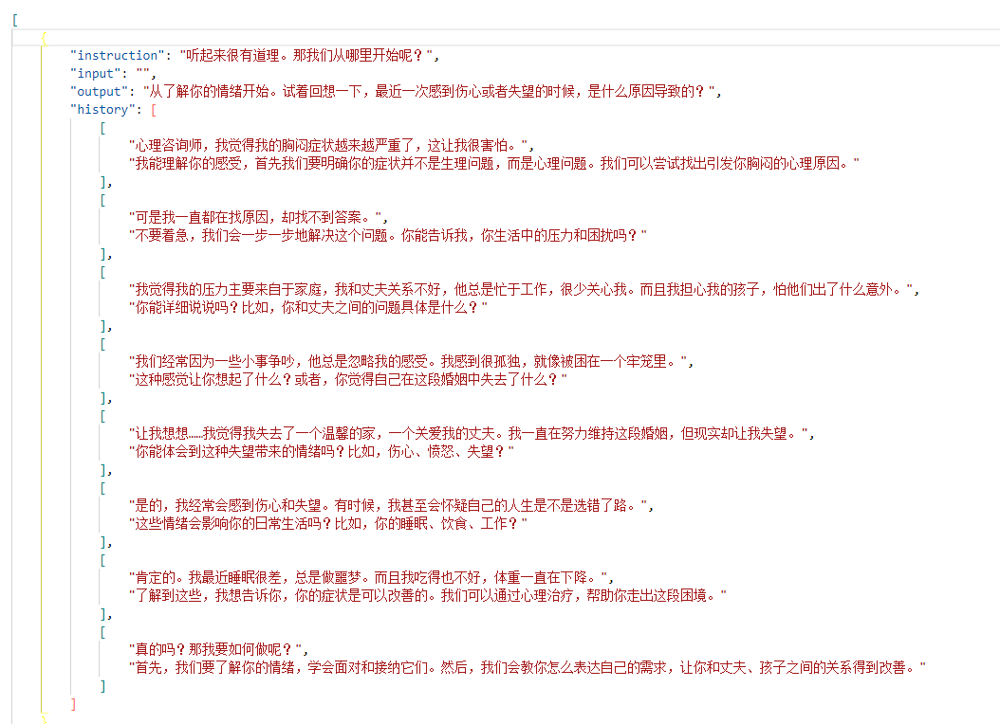
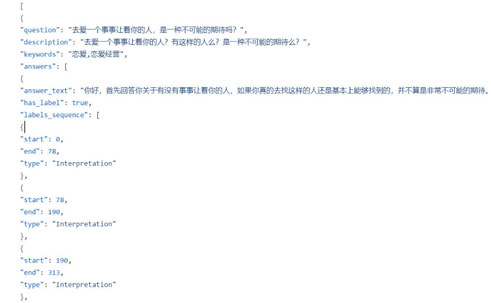
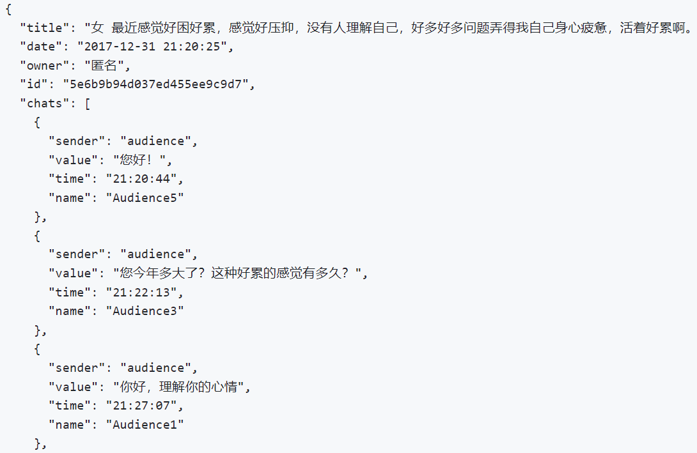
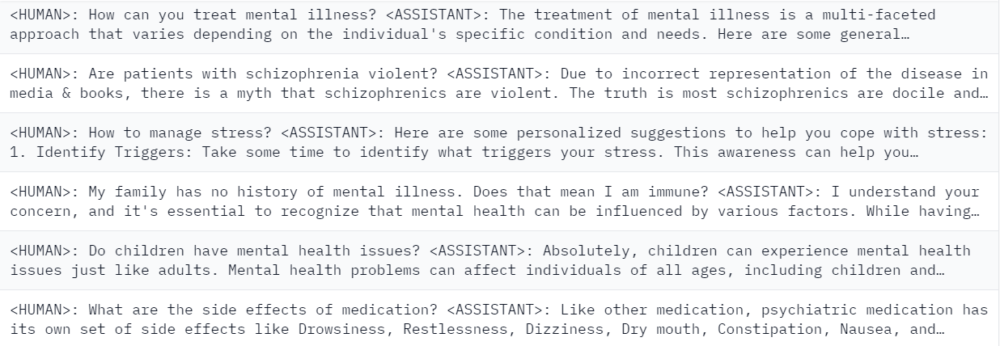
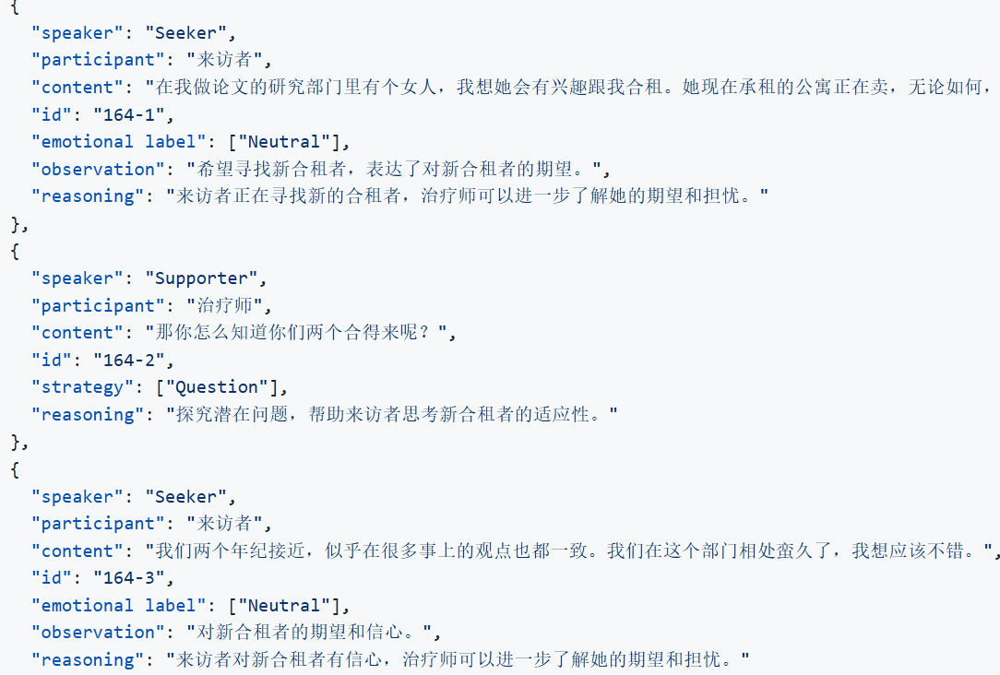
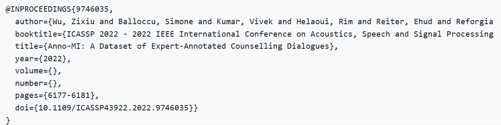

<div align="center"> 

# 冰智科技心理健康大语言模型项目

</div>
<!-- 项目徽标或图片 -->
<p align="center">
  <a href="https://your-project-link.com">
    
  </a>
</p>
<p align="center">
    <a href="./LICENSE"></a>
    <a href="#"></a>
    <a href="#"></a>
    <a href="https://github.com/glacierwisdom/wisdomGPT/graphs/contributors"></a>
    <a href="https://github.com/glacierwisdom/wisdomGPT/commits/main"></a>
    <a href="https://github.com/glacierwisdom/wisdomGPT/issues"></a>
    <a href="https://github.com/glacierwisdom/wisdomGPT/stargazers"></a>
</p>
<!-- 项目简介 -->
<h3 align="center">项目简介</h3>
<p align="center">
  本项目致力于基于大语言模型技术为心理健康领域提供创新解决方案，通过改进训练方法、使用特定数据集，提升大语言模型在心理咨询中的应用效果。
</p>

### 数据集

#### 💞 i. 共情对话数据集

​**SoulChatCorpus**​  


- ​**内容概述**​  
  包含 ​**230万清洗后样本**​ 的多轮共情对话，通过以下方式构建：  
  🔹 ​**单轮长文本**：215,813个心理咨询问题 → 619,725个专业回答  
  🔹 ​**多轮增强**：ChatGPT（99% gpt-3.5）生成 → 人工校对共情表达  
  🔹 ​**主题覆盖**：家庭/婚恋/职场等12类心理咨询场景（含敏感话题过滤）

- ​**核心创新**​  
  ✅ ​**共情要素注入**：每轮响应强制包含倾听/安慰/认可/信任等7类共情表达  
  ✅ ​**对话动态控制**：8-20轮渐进式引导，模拟真实心理咨询节奏  
  ✅ ​**安全合规**：过滤自杀/隐私相关表述，人工清洗105,134低质样本

- ​**学术验证**​  
  📜 [EMNLP 2023 Findings论文](https://aclanthology.org/2023.findings-emnlp.83/)  
  ▸ BLEU-4提升72.8% ▸ 人工评估共情得分1.84/2.0  
  ▸ 首个百万级中文心理共情对话数据集

- ​**资源获取**​  
  🔗 [ModelScope数据集](https://www.modelscope.cn/datasets/YIRONGCHEN/SoulChatCorpus)  
  💻 [项目源码仓库](https://github.com/scutcyr/SoulChat)
  
**GoEmotions**  

- **内容概述**  
  包含 **58,009** 条从 Reddit 中提取的评论，涵盖 **27** 种情感类别及中性标签，经过精心标注和过滤。

- **核心价值**  
  ✅ **情感多样性**：27 种情感类别 + 中性，覆盖广泛情绪表达  
  ✅ **高质量标注**：基于人类注释，提供高一致性的情感标签  
  ✅ **数据分割**：包含训练/测试/验证集，便于模型开发与评估  
  ✅ **序列长度**：最大序列长度为 30，适合短文本情感分析任务

  情感类别：  
  `赞赏、娱乐、愤怒、烦恼、赞同、关心、困惑、好奇、渴望、失望、不赞成、厌恶、尴尬、兴奋、恐惧、感激、悲伤、喜悦、爱、紧张、乐观、骄傲、实现、解脱、悔恨、悲伤、惊讶`

- **学术支持**  
  📜 [GoEmotions 论文](https://arxiv.org/abs/2005.00547)  
  *发表于 arXiv，提供细粒度情感分析的理论基础*

- **资源获取**  
  🔗 [项目地址](https://github.com/google-research/google-research/tree/master/goemotions)  
  📂 [数据集下载](https://hf-mirror.com/datasets/google-research-datasets/go_emotions)

  **EmpatheticDialogues**  

- **内容概述**  
  包含 **25,000+** 个人与人之间的对话，旨在引发共情反应。通过参与者分享个人故事并共情回应他人故事构建，情感丰富。

- **核心价值**  
  ✅ **共情对话**：专注于情感基础的个人情境，促进共情能力  
  ✅ **高质量构建**：通过真实参与者分享与回应，确保对话自然性  
  ✅ **情感丰富**：涵盖广泛情感场景，适合共情模型训练  
  ✅ **大规模数据**：超过 25,000 条对话，提供充足训练样本

- **数据统计**  
  | 数据集 | 样本量 |  
  |--------|--------|  
  | 对话总数 | 25,000+ |  
  | 情感类别 | 32 种 |  
  | 平均对话轮次 | 4.2 轮 |  

  情感类别示例：  
  `愤怒、悲伤、恐惧、喜悦、惊讶、信任、厌恶、期待`

- **学术支持**  
  📜 [EmpatheticDialogues 论文](https://arxiv.org/abs/1811.00207)  
  *发表于 arXiv，提供共情对话的理论基础与构建方法*

- **资源获取**  
  🔗 [项目地址](https://github.com/facebookresearch/EmpatheticDialogues)  
  📂 [数据集下载](https://hf-mirror.com/datasets/facebook/empathetic_dialogues)

  **CPsyCounD**
  
- **内容概述**  
  包含 **3,134** 个多轮咨询对话，通过 Memo2Demo 方法生成，覆盖 **9** 个代表性主题和 **7** 种经典心理咨询流派。

- **核心价值**  
  ✅ **多轮对话**：真实模拟心理咨询场景，提供连贯对话数据  
  ✅ **主题丰富**：涵盖个人成长、情绪压力、学业教育等 9 大主题  
  ✅ **流派多样**：整合精神分析、认知行为、人本主义等 7 种咨询流派  
  ✅ **高质量生成**：基于 Memo2Demo 方法，确保对话专业性与实用性

- **数据统计**  
  | 数据集 | 样本量 |  
  |--------|--------|  
  | 对话总数 | 3,134  |  
  | 主题数量 | 9 种   |  
  | 流派数量 | 7 种   |  

  主题与流派示例：  
  **主题**：`个人成长、情绪压力、学业教育、恋爱婚姻、家庭关系、人际关系、性心理、职业发展、心理疾病`  
  **流派**：`精神分析、认知行为、人本主义、家庭治疗、后现代主义、综合流派、其他流派`

- **学术支持**  
  📜 [CPsyCoun 论文](https://arxiv.org/abs/2405.16433)  
  *发表于 arXiv，提供多轮心理咨询对话生成的理论与方法*

- **资源获取**  
  🔗 [项目地址](https://github.com/CAS-SIAT-XinHai/CPsyCoun)  
  📂 [数据集下载](https://huggingface.co/datasets/CAS-SIAT-XinHai/CPsyCoun)


#### 💬ii. 对话数据集
-  **对话数据集**：该数据集包含大量心理健康对话数据，旨在为模型提供心理咨询相关的对话训练数据。

#### 😌iii. 情绪识别数据集
-  **情绪识别数据集**：用于提升模型识别情绪的能力，帮助模型更好地理解用户情绪并提供精准的反馈。

#### iv. 其他数据集
**Chinese Psychological QA DataSet**  


- ​**内容概述**​  
  包含 ​**102,845 条社区问答对**​ 的中文心理咨询服务对话记录，涵盖广泛的情感状态、心理问题及应对策略，旨在推动心理健康领域的自然语言处理（NLP）研究与应用。

- ​**核心价值**​  
  ✅ ​**高质量数据**：每一条问答对均经过精心筛选，确保数据的真实性与隐私性  
  ✅ ​**结构化设计**：采用标准 JSON 格式，包含问题、回答、问题类型等字段，便于预处理与分析  
  ✅ ​**丰富标签**：每个问题均标注分类标签（如焦虑、抑郁、人际关系等），支持快速定位特定领域  
  ✅ ​**多模态潜力**：为未来与语音、图像等媒介结合，开展跨模态心理健康研究奠定基础

- ​**数据规模**​  
  🔹 ​**总问答对**：102,845 条  
  🔹 ​**问题类型**：焦虑、抑郁、人际关系等 10+ 种分类  
  🔹 ​**数据格式**：标准 JSON 文件，便于开发者直接使用

- ​**应用场景**​  
  🔹 ​**智能心理咨询助手**：训练模型为在线平台提供 24/7 服务  
  🔹 ​**情绪识别与分析**：开发理解用户情绪的应用，辅助自我调节  
  🔹 ​**预防干预策略**：洞察潜在心理问题趋势，制定早期预警与干预方案  
  🔹 ​**心理健康教育**：构建案例库，助力心理健康教学与普及

- ​**项目特点**​  
  ✅ ​**针对性强**：专为中国语境下的心理咨询服务定制，更具实际意义  
  ✅ ​**开放源码**：遵循 Apache 2.0 协议，鼓励社区共创共享  
  ✅ ​**持续更新**：定期收集团新数据，保持时效性与全面性  
  ✅ ​**研究价值**：为 NLP 领域学术研究提供丰富素材，推动技术进步

- ​**资源获取**​  
  🔗 [GitCode 项目地址](https://github.com/flyrae/Chinese-Psychological-QA-DataSet/tree/master)  

**PsyQA**​  


- ​**内容概述**​  
  包含 ​**22,346 个问题**​ 和 ​**56,063 个回复**​ 的中文心理健康支持问答数据，标注了 6 种助人策略，旨在生成富有援助策略的长篇咨询文本。

- ​**核心价值**​  
  ✅ ​**助人策略标注**：每条回复均标注 6 种助人策略，支持生成专业的心理健康咨询文本  
  ✅ ​**高质量数据**：数据来源于壹心理社区，确保真实性与实用性  
  ✅ ​**长篇文本生成**：专注于生成长篇咨询文本，支持深度心理健康支持场景

- ​**数据规模**​  
  🔹 ​**问题数量**：22,346 个  
  🔹 ​**回复数量**：56,063 个  
  🔹 ​**助人策略**：6 种标注策略  
  🔹 ​**数据格式**：文本数据，便于直接使用

- ​**应用场景**​  
  🔹 ​**心理健康支持生成**：生成具有专业助人策略的长篇咨询文本  
  🔹 ​**心理咨询助手**：训练模型为在线心理咨询平台提供支持  
  🔹 ​**心理健康研究**：为心理健康领域的自然语言处理研究提供数据支持

- ​**项目特点**​  
  ✅ ​**中文数据集**：专为中文语境下的心理健康支持定制  
  ✅ ​**开放源码**：数据集与相关资源完全开源，支持社区贡献与研究  
  ✅ ​**学术价值**：为心理健康支持领域的文本生成研究提供丰富素材

- ​**资源获取**​  
  🔗 [数据集 GitHub 地址](https://github.com/thu-coai/PsyQA)  

- ​**学术支持**​  
  📜 [arXiv 论文](https://arxiv.org/abs/2106.01702)  
  *发表于 2021 年，推动心理健康支持领域的文本生成研究*


**Emotional First Aid Raw Dataset**​  


- ​**内容概述**​  
  包含 ​**172,316 个话题**​ 和 ​**2,381,273 条消息**​ 的心理健康支持原始语料库，总文本规模达 ​**44,514,786 字符**，专为人工智能技术在心理咨询领域的应用而设计。

- ​**核心价值**​  
  ✅ ​**高品质语料**：爬取自公开的心理健康网站，经过整理和脱敏处理，确保数据真实性与隐私性  
  ✅ ​**丰富对话结构**：每个话题包含发布者与评论者的多轮对话，支持深度分析与模型训练  
  ✅ ​**开放数据来源**：爬取自简*心理、豆*讨论组等平台，部分网站已关闭数据访问，语料库更具价值

- ​**数据规模**​  
  🔹 ​**话题数量**：172,316 个  
  🔹 ​**消息总数**：2,381,273 条  
  🔹 ​**文本规模**：44,514,786 字符  
  🔹 ​**平均评论数**：每个话题 12.8 条评论

- ​**数据格式**​  
  每条数据包含以下字段：  
  🔸 ​**title**：发布者发起的话题  
  🔸 ​**date**：发布时间  
  🔸 ​**owner**：发布者昵称（匿名化）  
  🔸 ​**id**：唯一标识 ID  
  🔸 ​**chats**：多轮对话记录，包含 sender（角色）、value（内容）、time（时间）、name（评论者名称，脱敏后）

- ​**应用场景**​  
  🔹 ​**心理健康研究**：为心理咨询领域的自然语言处理研究提供高质量数据支持  
  🔹 ​**对话系统训练**：训练多轮对话模型，支持心理健康领域的智能助手开发  
  🔹 ​**情感分析**：分析用户情感状态，辅助心理健康支持与干预

- ​**项目特点**​  
  ✅ ​**脱敏处理**：去除原始 URL、图片信息，重新生成评论者名称，确保数据隐私  
  ✅ ​**开放数据来源**：爬取自公开平台，语料库具有独特价值  
  ✅ ​**扩展潜力**：为人工标记的心理咨询问答语料库（efaqa-corpus-zh）提供原始数据支持

- ​**资源获取**​  
  🔗 [GitHub 数据集地址](https://github.com/chatopera/efaqa-corpus-raw)  

**Mental Health Chatbot Dataset**​  


- ​**内容概述**​  
  包含与心理健康相关的问题和答案的对话对，以单一文本形式呈现。数据来源于 ​**WebMD**、**Mayo Clinic**​ 和 ​**HealthLine**​ 等流行医疗博客，经过匿名化处理，确保数据隐私与安全性。

- ​**核心价值**​  
  ✅ ​**高质量对话**：精选自权威医疗博客，内容专业且实用  
  ✅ ​**匿名化处理**：去除个人身份信息（PII），确保数据隐私  
  ✅ ​**预处理优化**：清理不必要的字符，便于直接使用

- ​**数据规模**​  
  🔹 ​**语言**：英文  
  🔹 ​**格式**：单一文本列，包含患者与医疗提供者之间的对话  
  🔹 ​**字段**：`text`（对话文本）
- ​**资源获取**​  
  🔗 [数据集地址](https://huggingface.co/datasets/heliosbrahma/mental_health_chatbot_dataset?row=19)  

**Mental Health Chatbot**​  


- ​**内容概述**​  
  一个基于 AI 的心理健康聊天机器人，提供个性化的心理健康支持。通过训练于高质量数据集，其准确率达到 ​**96%**，能够为用户提供实时帮助、资源和保密互动，帮助个体有效管理心理健康。

- ​**核心价值**​  
  ✅ ​**高准确率**：基于高质量数据集训练，准确率达到 96%  
  ✅ ​**实时支持**：提供即时帮助和资源，满足用户需求  
  ✅ ​**保密互动**：确保用户隐私，提供安全、可靠的心理健康支持

- ​**应用场景**​  
  🔹 ​**个性化支持**：为用户提供定制化的心理健康建议  
  🔹 ​**资源推荐**：根据用户需求推荐相关心理健康资源  
  🔹 ​**情绪管理**：帮助用户识别和管理情绪，提升心理健康水平

- ​**项目特点**​  
  ✅ ​**AI 驱动**：基于先进的人工智能技术，提供智能化支持  
  ✅ ​**多语言支持**：支持英文、中文等多种语言，覆盖广泛用户群体  
  ✅ ​**隐私保护**：确保用户数据安全，提供保密互动体验

- ​**资源获取**​  
  🔗 [项目 GitHub 地址](https://github.com/Susanta37/Mental-Health-Chat-Bot-/tree/main)


**Psy-Insight**​  


- ​**内容概述**​  
  一个专注于心理健康咨询的可解释多轮双语数据集，包含 ​**10,000+ 对话标签对**，涵盖情绪、策略、心理治疗和分步解释等多种标签，旨在支持情感支持任务。

- ​**核心价值**​  
  ✅ ​**专业级数据**：基于心理学专家筛选的专业心理咨询对话，确保数据质量  
  ✅ ​**多轮对话**：支持长语境和多回合对话，缓解心理健康领域数据稀缺问题  
  ✅ ​**可解释性**：提供分步解释标签，增强模型生成响应的合理性

- ​**数据规模**​  
  🔹 ​**对话标签对**：10,000+  
  🔹 ​**语言支持**：中英双语  
  🔹 ​**标签类型**：情绪、策略、心理治疗、分步解释等

- ​**应用场景**​  
  🔹 ​**情感支持任务**：支持多项心理健康相关任务，如情绪识别、策略建议等  
  🔹 ​**模型训练**：为心理健康领域的 AI 模型提供高质量训练数据  
  🔹 ​**研究支持**：为心理健康研究提供数据支持，推动领域发展

- ​**项目特点**​  
  ✅ ​**专家筛选**：数据经过心理学专家和人工双重筛选，确保专业性  
  ✅ ​**标签丰富**：涵盖多种标签，支持多任务学习  
  ✅ ​**开源共享**：数据集和代码完全开源，支持社区共创

- ​**资源获取**​  
  🔗 [GitHub 存储库](https://github.com/ckqqqq/Psy-Insight?tab=readme-ov-file)  

- ​**学术支持**​  
  📜 [相关研究论文](https://anonymous.4open.science/w/Anonymous-Demo-Page-CF8E/static/pdfs/psy-insight.pdf)

**AnnoMI**​  


- ​**内容概述**​  
  一个公开且免费访问的专业转录和专家注释治疗对话数据集，包含 ​**133 次对话**，展示了高质量和低质量的动机性访谈（MI）。数据集由领域专家详细注释，涵盖 MI 的关键属性，为自然语言处理领域的研究人员提供高质量资源。

- ​**核心价值**​  
  ✅ ​**专业注释**：由领域专家详细注释，涵盖 MI 的关键属性  
  ✅ ​**高质量对话**：包含高质量和低质量的动机性访谈，支持对比分析  
  ✅ ​**免费开放**：数据集公开且免费访问，促进学术研究与创新

- ​**数据规模**​  
  🔹 ​**对话数量**：133 次  
  🔹 ​**注释类型**：治疗师行为、客户谈话类型等  
  🔹 ​**元数据**：每个转录本和话语的元数据，包括 MI 质量和原始视频 URL

- ​**应用场景**​  
  🔹 ​**咨询对话分析**：研究动机性访谈的结构和内容，提升咨询技术  
  🔹 ​**自然语言处理**：为 NLP 研究提供高质量数据，支持对话生成与分析  
  🔹 ​**教育培训**：用于心理学和咨询领域的教学与培训

- ​**项目特点**​  
  ✅ ​**跨机构合作**：由阿伯丁大学、飞利浦研究和卡利亚里大学联合发布  
  ✅ ​**详细注释**：每句话都有详细注释，支持深度分析  
  ✅ ​**透明流程**：详细介绍了数据收集、转录和注释过程

- ​**资源获取**​  
  🔗 [github 数据集](https://github.com/uccollab/AnnoMI)  

- ​**学术支持**​  
  📜 [相关研究论文](https://ieeexplore.ieee.org/document/9746035)

- 🌍 **The PRISM Alignment Dataset: What Participatory, Representative and Individualised Human Feedback Reveals About the Subjective and Multicultural Alignment of Large Language Models**，NeurIPS 2024 D&B Track 最佳论文，[[论文]](https://arxiv.org/abs/2404.16019)
  - 该数据集提供了来自多元文化背景的参与式反馈，揭示了人类反馈在大型语言模型中的对齐情况。
  
- ⭐️ **ValueBench: Towards Comprehensively Evaluating Value Orientations and Understanding of Large Language Models**，ACL 2024，[[论文]](https://arxiv.org/abs/2406.04214)，[[代码]](https://github.com/Value4AI/ValueBench)
  - 这个数据集旨在全面评估大型语言模型的价值取向和理解能力，提供了广泛的测试框架。

- 🔄 **Automating Dataset Updates Towards Reliable and Timely Evaluation of Large Language Models**，NeurIPS 2024，[[论文]](https://arxiv.org/abs/2402.11894)
  - 该数据集专注于自动化数据集更新，确保大型语言模型的评估始终可靠且及时。

- 🔍 [CLUE Dataset Search](https://github.com/CLUEbenchmark/CLUEDatasetSearch)
  - CLUE是一个全面的数据集搜索工具，帮助用户查找和访问多种语言的NLP数据集。

- 💬 **HATEDAY: Insights from a Global Hate Speech Dataset Representative of a Day on Twitter**，2024.11，[[论文]](https://arxiv.org/abs/2411.15462)
  - 该数据集收集了Twitter上一天内的仇恨言论数据，旨在研究社交媒体上的言论行为和情绪传播。

- 🌐 [LIT 下载链接](https://lit.eecs.umich.edu/downloads.html)
  - LIT是一个面向多语言和跨文化对话的NLP工具，提供了多种资源下载。

- 🔄 **COMPO: Community Preferences for Language Model Personalization**，2024.10，[[论文]](https://arxiv.org/pdf/2410.16027)
  - 该数据集用于了解和收集社区对于语言模型个性化的偏好，为模型优化提供依据。

- 🧠 **Cultural Commonsense Knowledge for Intercultural Dialogues**，CIKM 2024，[[论文]](https://dl.acm.org/doi/pdf/10.1145/3627673.3679768)，[[数据集]](https://mango.mpi-inf.mpg.de/)
  - 该数据集专注于跨文化对话中的常识性知识，旨在帮助模型更好地理解不同文化背景下的对话。

### 开源模型/论文情况
#### i. 不同版本开源模型列表及其介绍

<div align="center">

|         模型          |   微调方法   |               改进的模型              |   基准模型链接   |
| :-------------------: | :------: | :---------------------------------: |:------: |
|   **InternLM2_5_7B_chat**   | 全量微调   |  **InternLM2_5_7B_chat改进版**   |  [internlm2_5_chat_7b_full.py](./xtuner_config/internlm2_5_chat_7b_full.py)  | 
|   **InternLM2_5_7B_chat**   | QLoRA   |  **InternLM2_5_7B_chat QLoRA**   |  [internlm2_5_chat_7b_qlora_oasst1_e3.py](./xtuner_config/internlm2_5_chat_7b_qlora_oasst1_e3.py)  | [ModelScope](https://www.modelscope.cn/models/z342994309/emollm_interlm2_5/) |
|   **InternLM2_7B_chat**   | QLoRA   | **InternLM2_7B_chat QLoRA**    | [internlm2_7b_chat_qlora_e3.py](./xtuner_config/internlm2_7b_chat_qlora_e3.py)  | [ModelScope](https://modelscope.cn/models/aJupyter/EmoLLM/files) |
|   **InternLM2_7B_chat**   | 全量微调   | **InternLM2_7B_chat Full Model**  | [internlm2_chat_7b_full.py](./xtuner_config/internlm2_chat_7b_full.py)  | [OpenXLab](https://openxlab.org.cn/models/detail/ajupyter/EmoLLM_internlm2_7b_full) |
|   **InternLM2_7B_base**   | QLoRA   | **InternLM2_7B_base QLoRA**    | [internlm2_7b_base_qlora_e10_M_1e4_32_64.py](./xtuner_config/internlm2_7b_base_qlora_e10_M_1e4_32_64.py) | [OpenXLab](https://openxlab.org.cn/models/detail/chg0901/EmoLLM-InternLM7B-base-10e) |
|   **InternLM2_1_8B_chat**   | 全量微调 | **InternLM2_1_8B_chat Full Model** | [internlm2_1_8b_full_alpaca_e3.py](./xtuner_config/internlm2_1_8b_full_alpaca_e3.py) | [OpenXLab](https://openxlab.org.cn/models/detail/ajupyter/EmoLLM_internlm2_1_8b_full/tree/main) |
|   **InternLM2_20B_chat**   | LoRA   | **InternLM2_20B_chat LoRA**  | [internlm2_20b_chat_lora_alpaca_e3.py](./xtuner_config/internlm2_20b_chat_lora_alpaca_e3.py)  | |
|   **Qwen_7b_chat**     | QLoRA   | **Qwen_7B_chat QLoRA**      | [qwen_7b_chat_qlora_e3.py](./xtuner_config/qwen_7b_chat_qlora_e3.py)  | |
|   **Qwen1_5-0_5B-Chat** | 全量微调  | **Qwen1_5-0_5B-Chat Full Model** | [qwen1_5_0_5_B_full.py](./xtuner_config/qwen1_5_0_5_B_full.py) | [ModelScope](https://www.modelscope.cn/models/aJupyter/EmoLLM_Qwen1_5-0_5B-Chat_full_sft/summary) |
|   **Baichuan2_13B_chat**  | QLoRA   | **Baichuan2_13B_chat QLoRA**   | [baichuan2_13b_chat_qlora_alpaca_e3.py](./xtuner_config/baichuan2_13b_chat_qlora_alpaca_e3.py) | |
|   **ChatGLM3_6B**    | LoRA   | **ChatGLM3_6B LoRA**   | [chatglm3_6b_lora_alpaca_e3.py](./xtuner_config/chatglm3_6b_lora_alpaca_e3.py) | |
|   **DeepSeek MoE_16B_chat**  | QLoRA   | **DeepSeek MoE_16B_chat QLoRA** | [deepseek_moe_16b_chat_qlora_oasst1_e3.py](./xtuner_config/deepseek_moe_16b_chat_qlora_oasst1_e3.py) | |
|   **Mixtral 8x7B_instruct**   | QLoRA   | **Mixtral 8x7B_instruct QLoRA**   | [mixtral_8x7b_instruct_qlora_oasst1_e3.py](./xtuner_config/mixtral_8x7b_instruct_qlora_oasst1_e3.py)  | |
|   **LLaMA3_8B_instruct**    | QLoRA   | **LLaMA3_8B_instruct QLoRA**  | [aiwei_llama3_8b_instruct_qlora_e3.py](./xtuner_config/aiwei_llama3_8b_instruct_qlora_e3.py) | [OpenXLab](https://openxlab.org.cn/models/detail/ajupyter/EmoLLM-LLaMA3_8b_instruct_aiwei/tree/main) |
|   **LLaMA3_8B_instruct**    | QLoRA   | **LLaMA3_8B_instruct QLoRA**  | [llama3_8b_instruct_qlora_alpaca_e3_M_ruozhi_scM.py](./xtuner_config/llama3_8b_instruct_qlora_alpaca_e3_M_ruozhi_scM.py) | [OpenXLab](https://openxlab.org.cn/models/detail/chg0901/EmoLLM-Llama3-8B-Instruct3.0) |
|   **Qwen2-7B-Instruct**    | LoRA   | **Qwen2-7B-Instruct LoRA**   | [Qwen2-7B-Instruct_lora.py](./xtuner_config/Qwen2-7B-Instruct_lora.py)  | [ModelScope](https://www.modelscope.cn/models/aJupyter/EmoLLM_Qwen2-7B-Instruct_lora/) |

</div>

#### ii. 论文情况

<div align="center">

|       论文标题       | 发表会议   |                                                   链接                                                   |
| :-------------------: | :--------: | :------------------------------------------------------------------------------------------------------: |
| **The PRISM Alignment Dataset: What Participatory, Representative and Individualised Human Feedback Reveals About the Subjective and Multicultural Alignment of Large Language Models** | NeurIPS 2024 D&B Track | [论文](https://arxiv.org/abs/2404.16019) |
| **ValueBench: Towards Comprehensively Evaluating Value Orientations and Understanding of Large Language Models** | ACL 2024 | [论文](https://arxiv.org/abs/2406.04214)，[代码](https://github.com/Value4AI/ValueBench) |
| **Automating Dataset Updates Towards Reliable and Timely Evaluation of Large Language Models** | NeurIPS 2024 | [论文](https://arxiv.org/abs/2402.11894) |
| **HATEDAY: Insights from a Global Hate Speech Dataset Representative of a Day on Twitter** | 2024.11 | [论文](https://arxiv.org/abs/2411.15462) |
| **COMPO: Community Preferences for Language Model Personalization** | 2024.10 | [论文](https://arxiv.org/pdf/2410.16027) |
| **Cultural Commonsense Knowledge for Intercultural Dialogues** | CIKM 2024 | [论文](https://dl.acm.org/doi/pdf/10.1145/3627673.3679768)，[数据集](https://mango.mpi-inf.mpg.de/) |

</div>


### CARE 方案 (文献综述与共享)
#### i. Compassion
- 📚 文献 1：[文献标题](#)
- 📚 文献 2：[文献标题](#)

#### ii. Awareness
- 📚 文献 1：[文献标题](#)
- 📚 文献 2：[文献标题](#)

#### iii. Respect
- 📚 文献 1：[文献标题](#)
- 📚 文献 2：[文献标题](#)

#### iv. Empowerment
- 📚 文献 1：[文献标题](#)
- 📚 文献 2：[文献标题](#)

### 项目介绍 (Readme)
- 🌐 [项目主页](https://your-project-link.com)
- 📄 [项目文档](./README.md)

### 最近更新

- 【2025.02.16】**多智能体模拟心理咨询**
  - 🔬 论文 *A Simulated Well-being Ecosystem Featuring Positive Nudge Agents* 已投稿 2025 ICRA
  - 📌 代码仓库：[aitown-env3-upload](https://github.com/glacierwisdom/aitown-env3-upload)

- 【2025.02.15】**让大模型更了解心理**
  - 🎯 采用 [Qwen2.5-32B](https://huggingface.co/Qwen/Qwen2.5-32B-Instruct) 进行微调
  - 🧠 详细微调结果：[README](sft_0926_lr5e-5/README.md)
  - 📊 心理大模型评测：[国内心理大模型调研](https://github.com/glacierwisdom/wisdomGPT/blob/main/_DocumentRSS/PsycoLLM_evaluate.md)
  - 📂 数据集构建：[数据集与提示词](dataset_constructer)

- 【2025.02.10】**心理健康对话数据集更新**
  - 📚 新增了多轮对话数据集，扩展了模型训练数据。
  - 📌 数据集详细信息：[数据集文档](./datasets/README.md)

- 【2025.02.05】**情绪识别模型优化**
  - 🎯 采用新的情绪识别方法对模型进行优化，提高了识别精度。
  - 🧠 详细微调结果：[情绪识别微调日志](emotion_tuning_log.md)

- 【2025.01.30】**新版本的心理咨询模型发布**
  - 🚀 发布了基于Qwen2-32B-Instruct模型的最新版本，优化了情感分析和情绪识别功能。
  - 📌 模型文件下载：[Qwen2-32B-Instruct模型](https://huggingface.co/Qwen/Qwen2.5-32B-Instruct)

- 【2025.01.25】**更新了心理健康大语言模型的评测标准**
  - 📊 新增评测维度：文化敏感性、情感表达和语言流畅度。
  - 📑 详细文档：[评测标准文档](./docs/evaluation_criteria.md)


### 项目概况
- 🎯 **项目目标**：通过大语言模型，提供个性化的心理咨询解决方案，提升心理健康服务的质量和效果。
- 🌟 **项目愿景**：创建一个更加智能、互动的心理健康支持系统，帮助用户有效应对心理问题。
- 📚 **项目背景**：随着心理健康问题的日益普遍，传统的心理咨询方式面临资源有限、成本高昂等问题。本项目旨在利用人工智能技术，开发一个高效、可扩展的心理健康支持平台。
- 📝 **项目范围**：本项目涵盖数据集构建、模型训练与优化、系统开发与部署等多个阶段，致力于打造一个完整的心理健康支持解决方案。
- 👥 **项目团队**：冰智科技核心团队成员来自计算机科学、心理学及产品开发等领域，致力于心理健康领域的技术创新。
- 📈 **项目进展**：目前项目已完成初步模型开发，并在多个数据集上进行了验证。未来计划进一步优化模型性能，拓展应用场景，并进行大规模用户测试。
- 🎁 **项目价值**：通过技术创新，降低心理健康服务的门槛，为更多用户提供便捷、高效的心理支持服务。

---
### 🌟 参与成员
- **心理学支持**：童松、骆家怡  
- **算法与代码**：陈剑声、陈惠来、袁睿、闫柏旭  
- **UI 设计**：彭涛  
- **文档撰写**：陈剑声、闫柏旭  
- **战略指导**：张指浩  
- **数据标注与管理**：李明、王丽  
- **测试与反馈**：刘洋、赵静  

### 项目各模块说明
- 🗂️ **数据集**：详细介绍了项目中使用的心理健康对话数据集、情绪识别数据集等。
- 💻 **开源模型**：提供了开源模型及改进版的列表，说明了每个版本的特点与应用场景。
- 📑 **CARE 方案文献综述**：分享了与项目相关的心理健康方案文献和研究成果。

### 官方交流群
- 💬 加入我们的官方交流群，获取更多项目信息和帮助！
<p align="center">
  
</p>

### 曾获奖项
- 🏆 **奖项 1**：[奖项名称](#)
- 🏆 **奖项 2**：[奖项名称](#)

### 致谢
- wisdomGPT 由 **冰智科技** 发起，孵化于 **清华 i-Space**，并获得 **启迪种子基金** 支持。特别感谢 **清华大学** 给予的帮助！

### Star History
[](https://star-history.com/#your-github-username/your-project-name&Date)

---

## 🎯 开发与使用指南

### 开发前的配置要求
- 🖥️ **硬件要求**：支持GPU加速的设备，推荐NVIDIA GTX系列显卡。
- 📦 **软件依赖**：Python 3.8+、TensorFlow 2.0+、PyTorch等深度学习框架。

### 使用指南
1. 🤖 克隆项目：
```bash
git clone https://github.com/your-github-username/your-project-name.git
